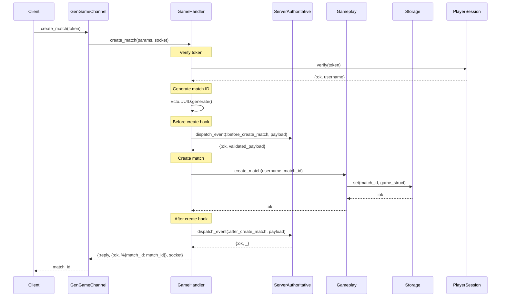
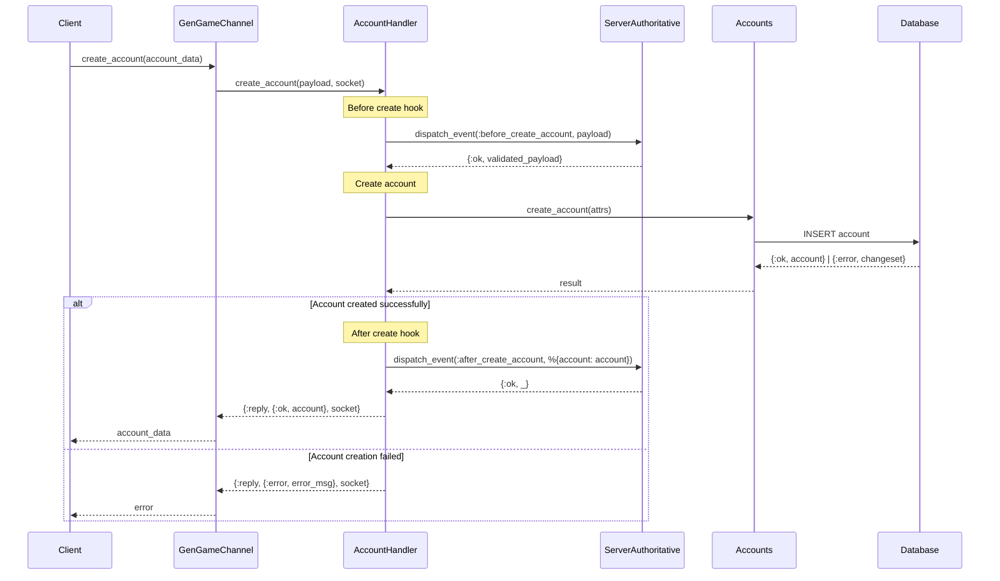
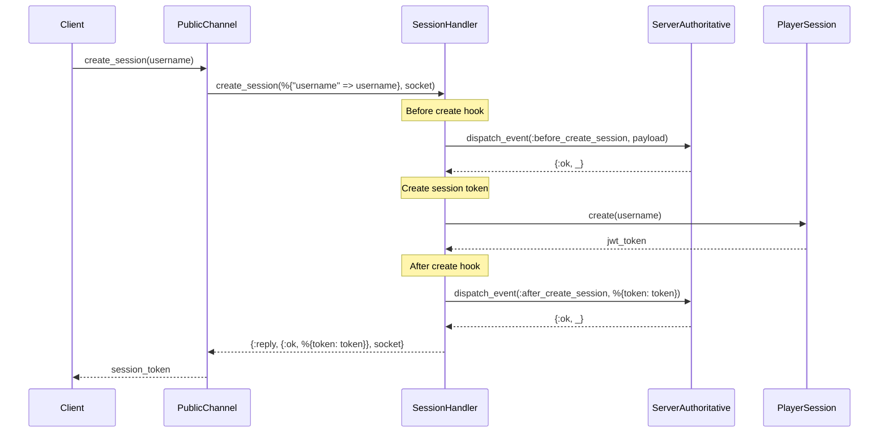
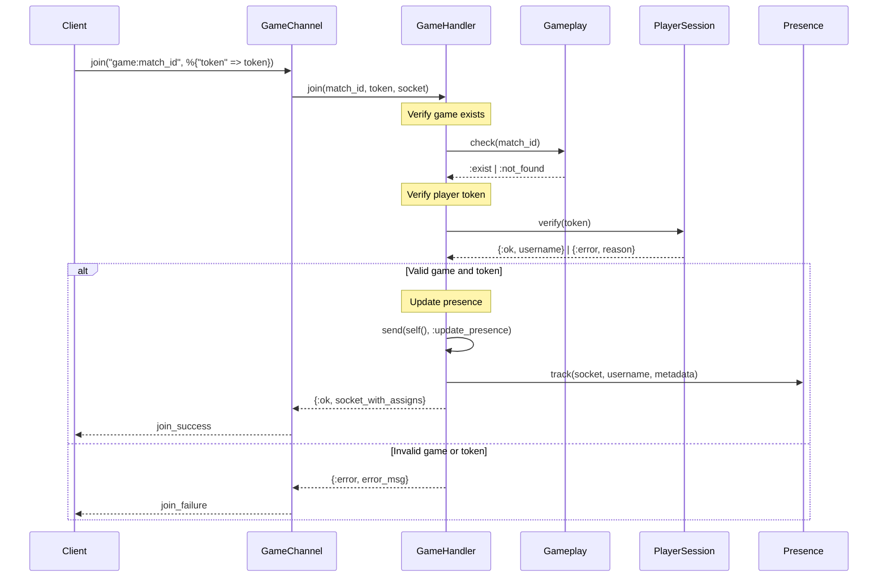

# Flow

This document describes the core flows in GenGame for game creation and player management.

## 1. How Games Are Created

The game creation process involves several steps with hooks for server authoritative actions:

### Game Creation Flow



### Detailed Steps

1. **Client Request**: Client sends `create_match` message with authentication token
2. **Token Verification**: Server verifies the player session token to get username
3. **Match ID Generation**: Server generates a unique UUID for the match
4. **Before Create Hook**: Dispatches `before_create_match` event for server authoritative validation
5. **Game Creation**: Creates a new game struct with initial state:
   - Status: `:started`
   - Players: `[owner_username]`
   - Created timestamp
   - Empty public/private/readonly states
6. **Storage**: Stores the game in distributed ETS storage
7. **After Create Hook**: Dispatches `after_create_match` event for post-creation actions
8. **Response**: Returns the match ID to the client

### Game Structure

```elixir
%Game{
  players: [username],           # List of player usernames
  public_state: %{},            # Client-modifiable state via relay
  private_state: %{},           # Server-only state (not visible to clients)
  read_only_state: %{},         # Read-only state visible to clients
  created_at: timestamp,        # Creation timestamp
  status: :started              # Game status (:open, :started, :finished)
}
```

## 2. How Players Are Created

Player creation involves both account creation and session management:

### Player Account Creation Flow



### Player Session Creation Flow



### Detailed Player Creation Steps

#### Account Creation

1. **Client Request**: Client sends account data (username, display_name, etc.)
2. **Before Create Hook**: Server authoritative validation
3. **Database Insert**: Creates account record with validation:
   - Required: `username`
   - Optional: `display_name`, `avatar_url`, `lang`, `timezone`, `metadata`, `email`, `wallet`
   - Unique constraint on username
4. **After Create Hook**: Post-creation server actions
5. **Response**: Returns account data or validation errors

#### Session Creation

1. **Username Submission**: Client provides username for session
2. **Before Session Hook**: Server authoritative validation
3. **Token Generation**: Creates JWT token with very long expiration (1000 years)
4. **After Session Hook**: Post-session creation actions
5. **Token Response**: Returns JWT token for authentication

### Player Joining Games



## Key Components

### Storage System

- **Distributed ETS**: Games stored in memory across cluster nodes
- **Auto-sync**: Changes automatically synchronized between nodes
- **PubSub**: Real-time updates via Phoenix PubSub

### Authentication

- **JWT Tokens**: Phoenix.Token for session management
- **Username-based**: Tokens contain username as payload

### Server Authoritative Hooks

- **Before/After Events**: Hooks for validation and side effects
- **Elixir Modules**: Direct function calls in same BEAM VM
- **HTTP Hooks**: External service integration via HTTP requests
- **Custom RPC**: Extensible remote procedure calls

### Real-time Features

- **Phoenix Channels**: WebSocket connections for real-time communication
- **Presence**: Track online players per game
- **State Relay**: Real-time state synchronization between players
